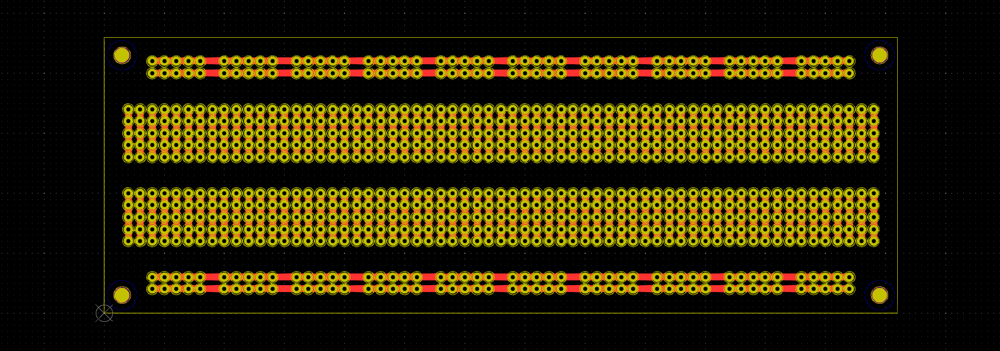
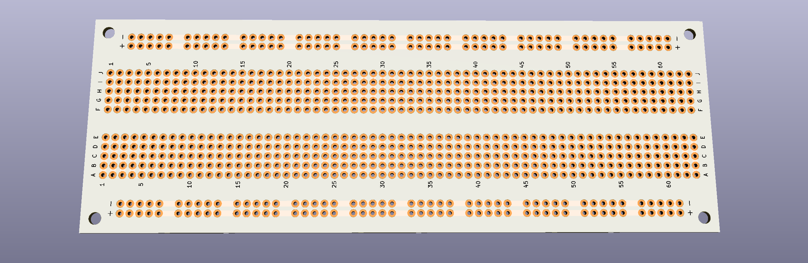

# SSB 830 PCB

830 pts solder-in Breadboard (Exact Solderless Match)

---

- 6.6" x 2.3" (167.64mm x 58.42mm)
- M3 3.2mm mounting holes
- 830 x 1mm (40mils) diameter THT holes
- 1.5mm (0.0592") trace width

### example Datasheet: 

[chipquick.com](http://www.chipquik.com/datasheets/SBB830.pdf)

---

#### Why I created this:

Simply because the commercially available breadboards on the market cost $5 ~ $10 per piece. Ordering your own batch of a few dozzen boards drops the price massively.

---

### License

Released to the Public Domain under CC0 License.
